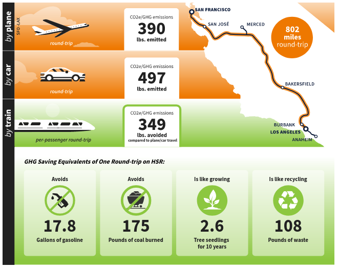

# California High Speed Rail makes the Worst Info Graphic Ever

Consider the [green house gas emission calculator](https://hsr.ca.gov/programs/green-practices-sustainability/carbon-footprint-calculator/) made by the California High Speed Rail Authority.

It is mind boggling how bad it is.

Just look at this atrocity. First, it tells us an estimate for how much carbon dioxide is emitted per passenger to travel round-trip Los Angeles to San Francisco, about 390 lbs. per passenger.

Then, it tells us how much carbon dioxide is emitted for the same round trip by car, about 497 lbs. per passenger.

In the third line they tell us the emissions *avoided* when traveling by train, about 349 lbs. per passenger.

Is that relative to the plane or relative to the car? I assume it is relative to a car, because for the segment San Francisco to Anaheim and back they estimate 389 lbs. saved, and the plane still uses 390 lbs. I highly doubt the train is so efficient to only use 1 lbs. for the entire trip?

How is is possible to create such a terrible info graphic? There are three numbers in one column. One of them means something entirely different from the other two. But it is not clear what exactly it means.

Mind boggling. Has the company that made these at least been fired?