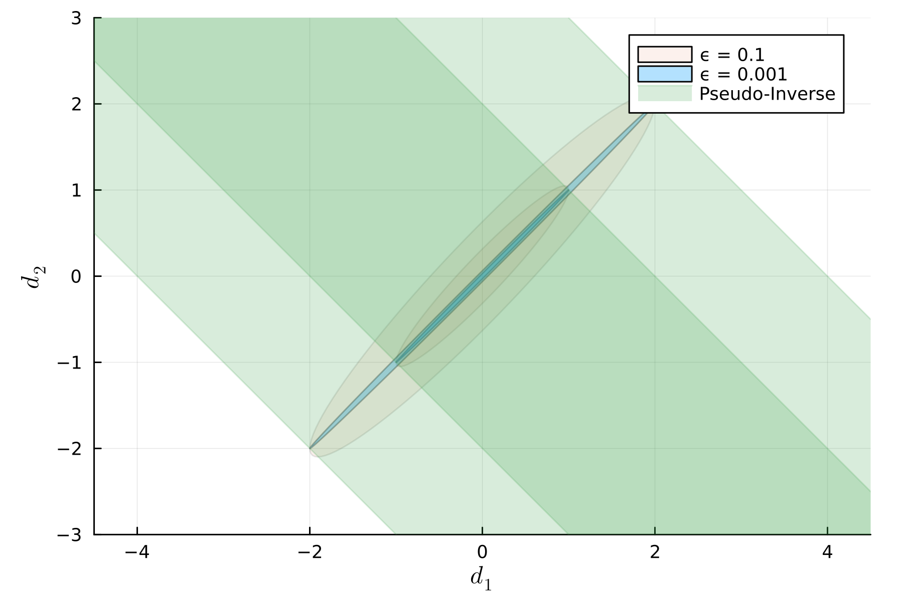

# The Degenerate Gaussian

{width=80%}

<!-- {width=80%} -->

<!-- {width=80%} -->

We often come across multivariate Gaussian distributions in which the
covariance matrix is singular. This can happen, for example, when measuring a
large number of variables (such as the Fourier modes of a density field) with a
window function applied. The window function correlates the modes, reducing the
number of degrees of freedom and giving a singular covariance matrix.

We are considering a multivariate Gaussian of the form
$$
p(d) = \frac{1}{\sqrt{\det(2\pi C)}}\,e^{-\frac12\, d^T C^{-1} d}\,,
$$
where $d$ is the data vector, and $C$ is the covariance matrix. (We will not be
so pedantic to insist on a notation that distinguishes between scalars,
vectors, and matrices -- there are so few, you will know the type of every
variable.)

The question is how to handle $C^{-1}$ when $C$ is singular?

In such cases, statistics often recommends (but also discourages) the use of
the [Moore-Penrose pseudo-inverse](https://en.wikipedia.org/wiki/Moore-Penrose_inverse).
However, the Moore-Penrose pseudo-inverse expands the errorellipse to infinity
in the nullspace of the covariance matrix when it should be collapsed to zero
there.

I will first argue that the correct procedure is to discard the nullspace of
the covariance matrix, and then I will show that the Moore-Penrose
pseudo-inverse instead does the opposite, and I will conclude with some closing
thoughts that using the pseudo-inverse at worst gives more conservative
constraints than the full likelihood.

## A simple example

Let's consider a simple $2$-dimensional example, where the two variables are
the same variable, let's call it $a$. In that case our data vector is
$d=(d_1,d_2)$ with $d_1=d_2=a$, and the covariance matrix is
$$
C = \begin{pmatrix} 1 & 1 \\ 1 & 1 + \epsilon \end{pmatrix}\,,
$$
with eigenvalues
$$
\lambda
= 1 + \epsilon/2 \pm\sqrt{1 + \epsilon^2/4}\,,
$$
which in the limit $\epsilon\to0$ are $\lambda=2+\epsilon/2,\epsilon/2$.
We have added a small $\epsilon>0$, because we
want to explore the degenerate limit $\epsilon\to0$ from above. (Note that we
cannot explore it from below where $\epsilon<0$, because then the matrix is no
longer semi-positive definite.)

The inverse is
$$
C^{-1} = \begin{pmatrix} \frac{1}{\epsilon}+1 & -\frac{1}{\epsilon} \\
-\frac{1}{\epsilon} & \frac{1}{\epsilon} \end{pmatrix}\,,
$$
and it has eigenvalues $\lambda=0.5-\epsilon,2/\epsilon$, in the limit
$\epsilon\to0$.

This makes sense: The near-zero eigenvalue gets a very large precision, but
because of the large correlation in the off-diagonal terms, this just means the
two variables $d_1$ and $d_2$ are tightly coupled to each other.

The errorellipse looks as in the plot below. Here, we have plotted the 1-σ and
2-σ contours for two values of $\epsilon$:

[{width=100%}](images/coveps.jl)

Because in the limit $\epsilon\to0$ the probability density vanishes everywhere
except when $d_1=d_2$, the 1-σ error ellipse is collapsed to a straight line
from (-1,-1) to (1,1).

## The nondegenerate subspace
More generally, let's say we have $n$ variables, but only $m<n$ degrees of
freedom. That is, there are $n-m$ linear combinations of the variables that are
fully coupled to the other $m$ linear combinations of the variables, and for
the covariance matrix there are $n-m$ eigenvalues that vanish.

The $n$-dimensional error ellipse is now collapsed into an $m$-dimensional
nondegenerate subspace.

This subspace is spanned by the eigenvectors corresponding to the nonzero
eigenvalues. We can project our data vector onto that subspace by forming a
matrix from these nondegenerate eigenvectors. Further, we can also deproject
back into the degenerate $n$-dimensional space with the transpose of that
matrix.

This procedure is quite similar to what is done for the Moore-Penrose
pseudo-inverse. However, it avoids sending the zero eigenvalues to zero,
instead avoiding the arising infinities by going to the nondegenerate subspace.

## The Moore-Penrose pseudo-inverse

In the limit $\epsilon\to0$, the Moore-Penrose pseudo-inverse does not exist,
since when $\epsilon=0$ the pseudo-inverse is
$$
C^+ = \begin{pmatrix} 0.25 & 0.25 \\ 0.25 & 0.25 \end{pmatrix}\,,
$$
with eigenvalues $\lambda = 0.5, 0$. As opposed to taking the inverse, the zero
eigenvalue did not get sent to infinity, but to zero.

This means that instead of the two variables getting coupled, one of them
remains unconstrained.

One way to see this is that any vector proportional to the eigenvector with
zero eigenvalue gets sent to the null-vector: $C^+\cdot v_0=(0,0)$, where
$v_0$ is a vector proportional to that eigenvector.

Therefore, changing that variable will always give the same probability density
in the Gaussian, because $d^T C^+ d = \mathrm{const}$ in that case.

To be a little more concrete, in the 2D case you can write out the probability
density with the pseudo-inverse. You will find that the probability density
does not change along any line where $d_1 - d_2 = \mathrm{const}$; it only
changes when $d_1+d_2$ changes. 

So instead of collapsing one of the dimensions of the error ellipse, the
Moore-Penrose pseudo-inverse expands it infinitely, as illustrated in the
following figure:

[{width=100%}](images/coveps.jl)

That is not what we want.

What we want is for the probability density to be a Gaussian along
$d_1+d_2=\mathrm{const}$, and vanish otherwise. That, is we want a Dirac-delta
along $d_2-d_1=\mathrm{const}$. We could get that if $d^T C^+ d$ were to send
the zero eigenvalue to infinity everywhere except in one point -- a sort of
anti-Dirac delta function. The actual inverse is the thing that gives us that,
and by projecting into the nondegenerate subspace we can avoid the numerical
difficulties of dealing with infinities.

## Does it matter?

There are several things to consider when evaluating whether this matters or
not. After all, we are rarely interested in the variables $d_1$ and $d_2$, but
rather in some set of parameters that depend on $d_1$ and $d_2$. Let's call
these the *parameters of interest*.

In the first case, the parameters of interest might only depend on the
nondegenerate subspace of the covariance matrix, $d_1 + d_2$ in our example. In
that case, the pseudo-inverse will give exactly the same probability
distribution as the original likelihood.

In the second case, the parameters of interest will depend on the nullspace as
well. The resulting constraint might still be finite, however, either because
the dependence on the nullspace is nonlinear and actually constrained, or
perhaps we have a prior that constrains it. Otherwise, the constraints will be
infinite.

To conclude, in the best case, using the pseudo-inverse will give the same
constraints on parameters as the actual likelihood, and in the worst case, the
constraints will be much looser.
